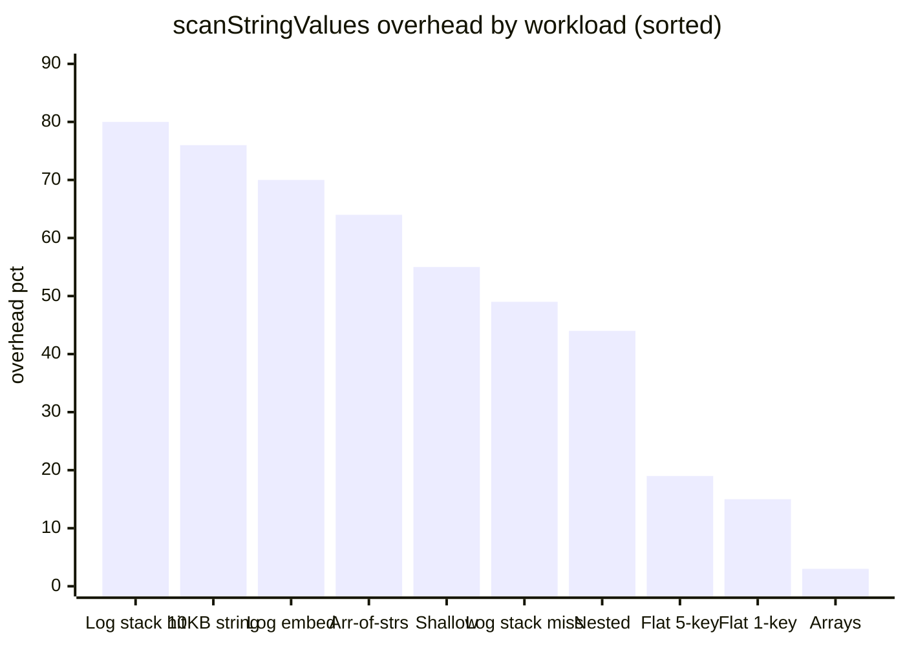
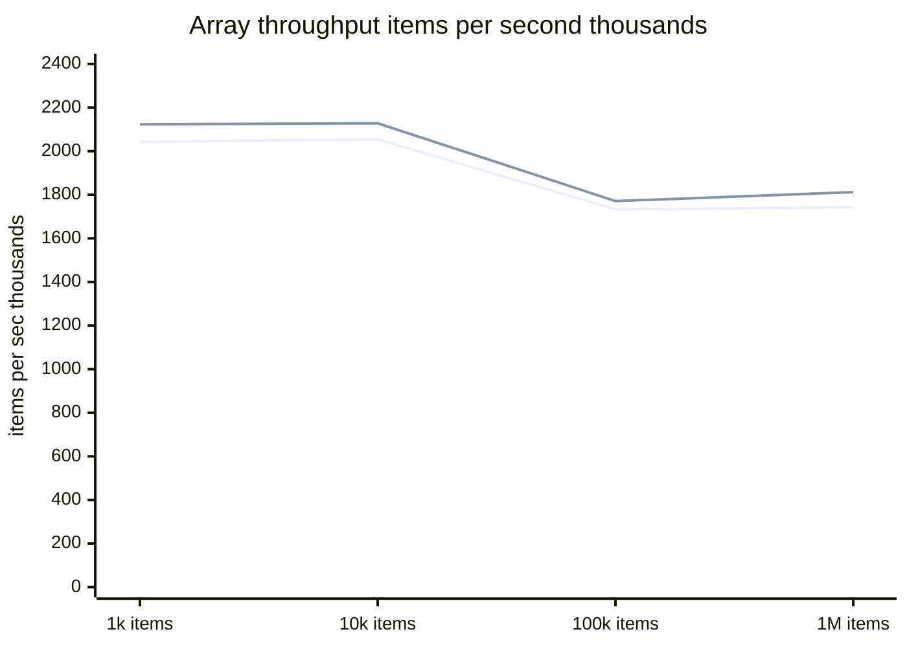

# Performance

`sanitizeData` is designed for in-process sanitization of log payloads,
request/response objects, and similar data before they leave your application.
It is not designed for streaming pipelines or bulk batch processing of large
files.

All numbers below are rough throughput on a modern laptop (Apple M-series,
Node.js 22). Run the suite yourself with `yarn bench`.

## String-value scanning overhead

String-value scanning (`scanStringValues: true`, the default) checks every
non-sensitive string field for embedded patterns using a fast OR pre-filter
before running the full regex suite. The pre-filter cost is low even when no
pattern matches, but it is not zero — the overhead scales with the length and
quantity of non-sensitive string values in the input.

The chart below shows the throughput reduction from enabling scanning relative
to disabling it, sorted from highest to lowest overhead:



Key observations:

- **Log objects with long strings** pay the most — even a clean stack trace
  with no matches incurs ~49% overhead because the pre-filter must scan a long
  string. A matching stack trace hits ~80%.
- **10KB non-sensitive string values** incur ~76% overhead — the pre-filter
  must scan the full length even when it exits immediately with no match.
- **Array-of-strings fields** (e.g. 100 log lines) pay ~64% — per-item
  pre-filter cost accumulates across all array elements.
- **Small shallow objects** pay ~44–55% overhead — visible but
  sub-millisecond (~0.004–0.005 ms/call).
- **Large flat objects** pay ~15–19% — scanning 45–49 non-sensitive fields
  costs less per field than scanning fewer long fields.
- **Arrays** pay only ~2–4% — the per-item pre-filter cost is negligible
  compared to the work of traversing each item.

## Array scaling

Array throughput scales nearly linearly with item count. The chart below shows
items processed per second (ops/s × items/call) across four sizes for simple
items (3 fields, 1 sensitive key), with scan enabled and disabled:



The two lines are scan enabled (lower) and scan disabled (upper). They are
nearly indistinguishable — the ~4% gap is smaller than benchmark noise at this
scale. The slight drop at 100k and 1M items reflects GC pressure from the
large input array, not algorithmic degradation.

## Object workload benchmarks

Rough throughput on a modern laptop (Apple M-series, Node.js 22):

<table>
  <thead>
    <tr>
      <th rowspan="2">Workload</th>
      <th rowspan="2">Case</th>
      <th colspan="2"><code>scanStringValues: true</code></th>
      <th colspan="2"><code>scanStringValues: false</code></th>
      <th rowspan="2">scan overhead</th>
    </tr>
    <tr>
      <th>ops/s</th>
      <th>ms/call</th>
      <th>ops/s</th>
      <th>ms/call</th>
    </tr>
  </thead>
  <tbody>
    <tr>
      <td rowspan="2">Shallow object (4 fields)</td>
      <td>1 sensitive key</td>
      <td>~243,000</td><td>~0.004</td>
      <td>~545,000</td><td>~0.002</td>
      <td>~55%</td>
    </tr>
    <tr>
      <td>4 sensitive keys (all)</td>
      <td>~253,000</td><td>~0.004</td>
      <td>—</td><td>—</td>
      <td>—</td>
    </tr>
    <tr>
      <td>Deeply nested (5 levels)</td>
      <td>multiple sensitive keys</td>
      <td>~202,000</td><td>~0.005</td>
      <td>~363,000</td><td>~0.003</td>
      <td>~44%</td>
    </tr>
    <tr>
      <td rowspan="3">Log object (5 fields)</td>
      <td>embedded credential in string value</td>
      <td>~107,000</td><td>~0.009</td>
      <td>~360,000</td><td>~0.003</td>
      <td>~70%</td>
    </tr>
    <tr>
      <td>stack trace with embedded credentials</td>
      <td>~79,000</td><td>~0.013</td>
      <td>~388,000</td><td>~0.003</td>
      <td>~80%</td>
    </tr>
    <tr>
      <td>clean stack trace (pre-filter fast-exit)</td>
      <td>~199,000</td><td>~0.005</td>
      <td>~389,000</td><td>~0.003</td>
      <td>~49%</td>
    </tr>
    <tr>
      <td>Many embedded matches (21 fields)</td>
      <td>20 string values all containing a pattern</td>
      <td>~13,000</td><td>~0.077</td>
      <td>—</td><td>—</td>
      <td>—</td>
    </tr>
    <tr>
      <td rowspan="2">Large flat object (50 fields)</td>
      <td>1 sensitive key</td>
      <td>~69,000</td><td>~0.015</td>
      <td>~80,000</td><td>~0.012</td>
      <td>~15%</td>
    </tr>
    <tr>
      <td>5 sensitive keys</td>
      <td>~69,000</td><td>~0.015</td>
      <td>~86,000</td><td>~0.012</td>
      <td>~19%</td>
    </tr>
    <tr>
      <td rowspan="2">Object with 10KB string field</td>
      <td>1 sensitive key + 10KB non-sensitive value</td>
      <td>~143,000</td><td>~0.007</td>
      <td>~596,000</td><td>~0.002</td>
      <td>~76%</td>
    </tr>
    <tr>
      <td>array-of-strings field (100 clean log lines)</td>
      <td>~151,000</td><td>~0.007</td>
      <td>~415,000</td><td>~0.002</td>
      <td>~64%</td>
    </tr>
    <tr>
      <td>Deeply nested (5 × 10 safe strings)</td>
      <td>5 levels, 10 non-sensitive string fields each</td>
      <td>~29,000</td><td>~0.035</td>
      <td>~32,000</td><td>~0.031</td>
      <td>~11%</td>
    </tr>
    <tr>
      <td rowspan="4">Array — simple items<br>(3 fields: 1 sensitive)</td>
      <td>1,000 items</td>
      <td>~2,043</td><td>~0.49</td>
      <td>~2,123</td><td>~0.47</td>
      <td>~4%</td>
    </tr>
    <tr>
      <td>10,000 items</td>
      <td>~205</td><td>~4.9</td>
      <td>~213</td><td>~4.7</td>
      <td>~4%</td>
    </tr>
    <tr>
      <td>100,000 items</td>
      <td>~17</td><td>~58</td>
      <td>~18</td><td>~56</td>
      <td>~2%</td>
    </tr>
    <tr>
      <td>1,000,000 items</td>
      <td>~1.7</td><td>~574</td>
      <td>~1.8</td><td>~552</td>
      <td>~4%</td>
    </tr>
    <tr>
      <td rowspan="4">Array — complex items<br>(10 fields: 5 sensitive)</td>
      <td>1,000 items</td>
      <td>~516</td><td>~1.94</td>
      <td>~539</td><td>~1.86</td>
      <td>~4%</td>
    </tr>
    <tr>
      <td>10,000 items</td>
      <td>~51</td><td>~19.5</td>
      <td>~53</td><td>~18.9</td>
      <td>~3%</td>
    </tr>
    <tr>
      <td>100,000 items</td>
      <td>~5.0</td><td>~201</td>
      <td>~5.0</td><td>~201</td>
      <td>~0%</td>
    </tr>
    <tr>
      <td>1,000,000 items</td>
      <td>~0.50</td><td>~2,015</td>
      <td>~0.50</td><td>~1,982</td>
      <td>~2%</td>
    </tr>
  </tbody>
</table>

The "Many embedded matches" case is the worst case: every scanned string value
actually contains a pattern and runs the full regex suite.

Set `scanStringValues: false` to recover the pre-scanning performance when you
control your data structure and know sensitive values only appear on
sensitive-named keys.

## Cold start cost

On first call with a given set of options, `sanitizeData` compiles and caches
the regex set for that configuration. Subsequent calls with the same options
reuse the cache and pay no compile cost.

| Case                                 | ops/s    | ms/call |
| ------------------------------------ | -------- | ------- |
| Warm cache (same options each call)  | ~246,000 | ~0.004  |
| Cold start (unique options per call) | ~14,000  | ~0.070  |

The first call is ~17× slower than a warm call due to regex compilation.
In steady-state server usage this cost is paid once per process lifetime and
is negligible. It becomes visible only in tests or scripts that create many
distinct option configurations (e.g. per-request custom patterns).

See [Cache memory growth](#cache-memory-growth) below for the memory
implication of many distinct configurations.

## removeMatches overhead

`removeMatches: true` deletes matched fields from objects and matched
key=value pairs from strings instead of masking them. The cost is similar to
masking for objects but slightly higher for string inputs due to regex
replacement pattern differences.

<table>
  <thead>
    <tr>
      <th rowspan="2">Workload</th>
      <th colspan="2">mask (default)</th>
      <th colspan="2">remove</th>
      <th rowspan="2">remove overhead</th>
    </tr>
    <tr>
      <th>ops/s</th>
      <th>ms/call</th>
      <th>ops/s</th>
      <th>ms/call</th>
    </tr>
  </thead>
  <tbody>
    <tr>
      <td>Shallow object (4 fields, 1 sensitive)</td>
      <td>~234,000</td><td>~0.004</td>
      <td>~234,000</td><td>~0.004</td>
      <td>~0%</td>
    </tr>
    <tr>
      <td>Large flat object (50 fields, 1 sensitive)</td>
      <td>~68,000</td><td>~0.015</td>
      <td>~61,000</td><td>~0.016</td>
      <td>~11%</td>
    </tr>
    <tr>
      <td>Array (1,000 items, 1 sensitive key)</td>
      <td>~2,096</td><td>~0.48</td>
      <td>~1,979</td><td>~0.51</td>
      <td>~6%</td>
    </tr>
    <tr>
      <td>Form-encoded string</td>
      <td>~101,000</td><td>~0.010</td>
      <td>~81,000</td><td>~0.012</td>
      <td>~20%</td>
    </tr>
  </tbody>
</table>

For objects, removal and masking are nearly equivalent — both write a result
object with the same traversal cost. For strings, removal is 10–20% slower
because the match-and-remove regex path involves different replacement
semantics than the `$1<mask>$2` substitution.

## String workloads

String input always scans the full string regardless of `scanStringValues`.
The option only affects the object traversal path.

| Workload                                        | ops/s    | ms/call | remove ops/s |
| ----------------------------------------------- | -------- | ------- | ------------ |
| Long JSON string (50 sensitive key/value pairs) | ~6,989   | ~0.143  | —            |
| Form-encoded string (1 sensitive field)         | ~102,000 | ~0.010  | ~84,000      |
| Escaped JSON string (1 sensitive field)         | ~91,000  | ~0.011  | ~69,000      |

## Parser-first JSON strings

When `parseJsonStrings: true` is set, string inputs that are valid JSON objects
or arrays are parsed and sanitized via the object path rather than the regex
path. The parse-and-re-serialize overhead is offset by the fact that the object
traversal is faster than running each pattern against every matcher across the
full string. The key correctness advantage is that numeric-typed sensitive
fields (e.g. `{"password":12345}`) are masked with `numericMask` — the default
regex path cannot detect or replace bare numeric values in strings.

| Group | Variant                     | ops/s    | ms/call |
| ----- | --------------------------- | -------- | ------- |
| small | `parseJsonStrings` disabled | ~65,783  | ~0.0152 |
| small | `parseJsonStrings` enabled  | ~271,150 | ~0.0037 |
| large | `parseJsonStrings` disabled | ~17,164  | ~0.0583 |
| large | `parseJsonStrings` enabled  | ~50,848  | ~0.0197 |

The large input case also demonstrates the correctness benefit: with
`parseJsonStrings` enabled, numeric `token_N` fields are correctly masked with
`numericMask`, whereas the default regex path leaves them unmasked.

## High pattern counts

Pattern count affects object workloads proportionally when
`scanStringValues: true`. With default patterns disabled:

| Workload                                               | ops/s   | ms/call |
| ------------------------------------------------------ | ------- | ------- |
| 50-field object, 50 custom patterns (no string match)  | ~22,000 | ~0.046  |
| 3-field object, 50 custom patterns (no string match)   | ~55,000 | ~0.018  |
| 3-field object, 50 custom patterns (string value hits) | ~18,000 | ~0.056  |

## Production gotchas

### Cache memory growth

`sanitizeData` caches compiled regex sets in a module-level LRU `Map` keyed
by the full option fingerprint (matchers + patterns + `removeMatches` flag).
The cache holds at most **10 entries**; when full, the least-recently-used
entry is evicted to make room for the new one.

In steady-state usage — a fixed configuration, possibly with a static list of
`customPatterns` — the cache stays at 1–3 entries and this is not a concern.

If `customPatterns` vary per call (e.g. injected from user input or request
data), entries will cycle through the cache and every call will pay the
cold-start regex compilation cost (~17× slower than a warm call). In that
scenario, prebuild the options object once (or a small set of them) and reuse
it across calls. Or set `scanStringValues: false`, which bypasses the cache
entirely.

### Form-encoded matcher and multiline strings

The built-in form-encoded matcher uses `[^\n&]*` to match a field value —
stopping at either an `&` delimiter or a newline. This means content on lines
after a matched value is preserved:

```text
Input:  "Error: auth failed — api_key=hunter2\n    at foo (bar.js:10)"
Output: "Error: auth failed — api_key=**********\n    at foo (bar.js:10)"
```

Stack traces and other multiline fields are safe to scan.

## Running the benchmarks

```bash
yarn bench
```

Benchmarks live in [`bench/sanitize-data.bench.ts`](../bench/sanitize-data.bench.ts).
